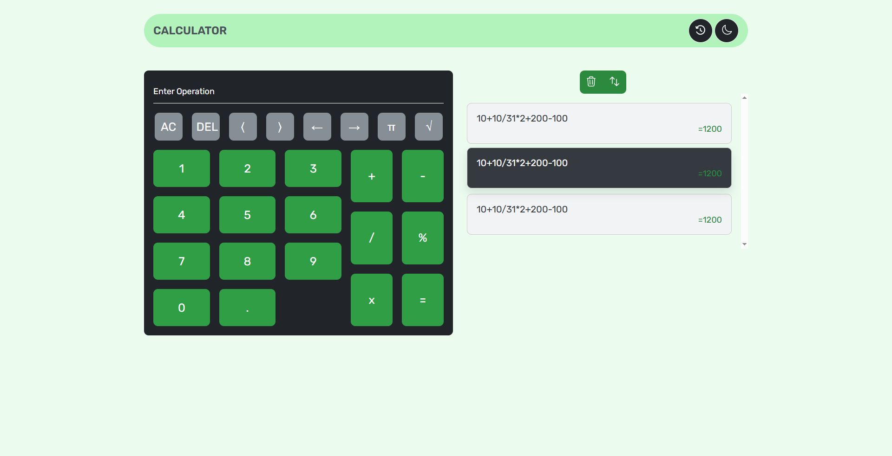

# CALCULATOR WITH JAVASCRIPT PROJECT

A simple **Calculator Project** built with **JavaScript** to practice and apply multiple core concepts of modern JavaScript development.

- **Design Patterns (MVC)** – Applying the Model-View-Controller pattern for clean architecture
- **Publisher–Subscriber Pattern** – Decoupling components through event-based communication
- **Array Methods** – Practical use of `map()`, `sort()`, and `filter()`
- **Parcel Bundler** – Using Parcel for efficient bundling and project setup
- **NPM Packages** – Managing dependencies in a professional workflow

## IMAGE OF PROJECT



## PROJECT SETUP

clone the repository and install dependencies :

```bash
git clone https://github.com/mouadbimk/project-calculator-javascript
cd project-calculator-javascript
npm install
npm run start
```
